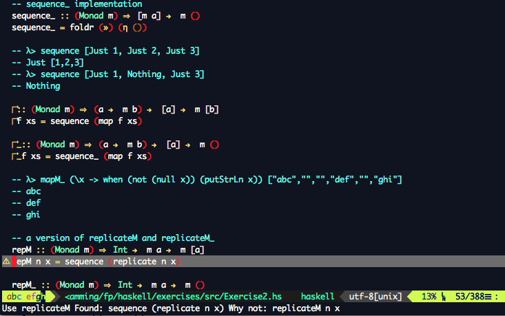

                                VIM CONFIGURATION
                                -----------------

This is my personal `vim` and `macvim` configuration, with plugins for all technologies
over which I work or play.

The `vimrc` file should be easy to understand and contains almost everything with explanatory comments.
The configuration is split across 4 files

- The main vim configuration file `vimrc`
-  `core_settings.vim` containing all the editor specific settings
- `bundled_plugins.vim` containing the list of plugins
- `plugin_settings.vim` containing the custom settings for installed plugins.

# Installation
----------------
```sh
        git clone https://github.com/singamsetty/vimrc.git .vim
        ln -s .vim/vimrc .vimrc
        vim +PlugInstall +qall
        cd ~/.vim/plugged/vimproc.vim && make # this step is not needed now
```

for `Haskell` install the ghc-mod package
```haskell
        cabal -v install ghc-mod
```

### YouCompleteMe for `cpp` and `python3` completion using `macvim`

>YouCompleteMe was installed using the homebrew set `python3` with `macvim`. Configuration in the `.vimrc` was updated to pick the `ycm` configuration only for `macvim`. The following steps were taken to install and configure `ycm`.

>*Update the `.vimrc` configuration file with the below entry in the plugins sections*

```vim
if has("gui_running")
    Plug 'valloric/youcompleteme', { 'for': ['cpp','python']  }
endif
```

Open `macvim` or `gvim` and run `:PlugInstall`

>for installing the ycm plugin, once the plugin is downloaded via `vim-plug`  to the
>appropriate location switch to `.vim/plugged/youcompleteme` and set the environment
>variable as follows this variable is needed for building the ycm

```bash
export EXTRA_CMAKE_ARGS="-DEXTERNAL_LIBCLANG_PATH=/Library/Developer/CommandLineTools/usr/lib/libclang.dylib"

# execute the python installation script using the python3 binary as below
# any additional language options can be provided here as flags

python3 ./install.py --clang-completer --system-libclang

```

- Wait for the build to complete and ensure that its a success as shown below, else check the error message

```bash
Scanning dependencies of target ycm_core
[ 83%] Building CXX object ycm/CMakeFiles/ycm_core.dir/Candidate.cpp.o
[ 84%] Building CXX object ycm/CMakeFiles/ycm_core.dir/CandidateRepository.cpp.o
[ 85%] Building CXX object ycm/CMakeFiles/ycm_core.dir/ClangCompleter/ClangCompleter.cpp.o
[ 85%] Building CXX object ycm/CMakeFiles/ycm_core.dir/ClangCompleter/ClangHelpers.cpp.o
[ 86%] Building CXX object ycm/CMakeFiles/ycm_core.dir/ClangCompleter/ClangUtils.cpp.o
[ 88%] Building CXX object ycm/CMakeFiles/ycm_core.dir/ClangCompleter/CompilationDatabase.cpp.o
[ 88%] Building CXX object ycm/CMakeFiles/ycm_core.dir/ClangCompleter/CompletionData.cpp.o
[ 89%] Building CXX object ycm/CMakeFiles/ycm_core.dir/ClangCompleter/Documentation.cpp.o
[ 89%] Building CXX object ycm/CMakeFiles/ycm_core.dir/ClangCompleter/Range.cpp.o
[ 90%] Building CXX object ycm/CMakeFiles/ycm_core.dir/ClangCompleter/TranslationUnit.cpp.o
[ 91%] Building CXX object ycm/CMakeFiles/ycm_core.dir/ClangCompleter/TranslationUnitStore.cpp.o
[ 91%] Building CXX object ycm/CMakeFiles/ycm_core.dir/CustomAssert.cpp.o
[ 92%] Building CXX object ycm/CMakeFiles/ycm_core.dir/IdentifierCompleter.cpp.o
[ 94%] Building CXX object ycm/CMakeFiles/ycm_core.dir/IdentifierDatabase.cpp.o
[ 94%] Building CXX object ycm/CMakeFiles/ycm_core.dir/IdentifierUtils.cpp.o
[ 95%] Building CXX object ycm/CMakeFiles/ycm_core.dir/LetterNode.cpp.o
[ 95%] Building CXX object ycm/CMakeFiles/ycm_core.dir/LetterNodeListMap.cpp.o
[ 96%] Building CXX object ycm/CMakeFiles/ycm_core.dir/PythonSupport.cpp.o
[ 97%] Building CXX object ycm/CMakeFiles/ycm_core.dir/Result.cpp.o
[ 97%] Building CXX object ycm/CMakeFiles/ycm_core.dir/Utils.cpp.o
[ 98%] Building CXX object ycm/CMakeFiles/ycm_core.dir/versioning.cpp.o
[100%] Building CXX object ycm/CMakeFiles/ycm_core.dir/ycm_core.cpp.o
[100%] Linking CXX shared library /Users/username/.vim/plugged/youcompleteme/third_party/ycmd/ycm_core.so
[100%] Built target ycm_core
```

- Fire up `vim` and check the Plugins status as below

`:PlugStatus`

This should show the status of each plugin.


- Haskell syntax highlighting and real-time checking will be shown as below



