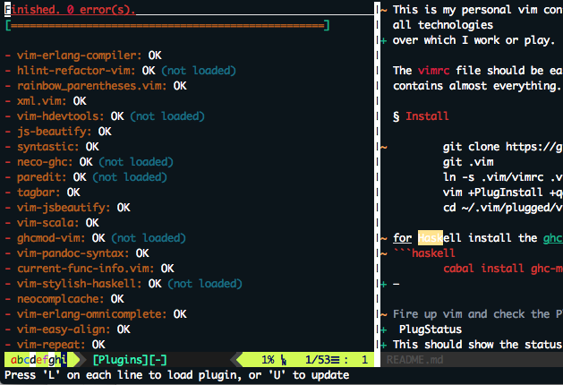

This is my personal vim configuration, with plugins for all technologies
over which I work or play.

The `vimrc` file should be easy to understand and contains almost everything.

# Install

        git clone https://github.com/singamsetty/vimrc.git .vim
        ln -s .vim/vimrc .vimrc
        vim +PlugInstall +qall
        cd ~/.vim/plugged/vimproc.vim && make

for Haskell install the ghc-mod package
```haskell
        cabal install ghc-mod
```

### YouCompleteMe for `cpp` and `python3` completion using `macvim`

>YouCompleteMe was installed using the homebrew set `python3` with `macvim`. Configuration in the `.vimrc` was updated to pick the `ycm` configuration only for `macvim`. The following steps were taken to install and configure `ycm`.

>*Update the configuration file with the below entry*

```vim
if has("gui_running")
    Plug 'valloric/youcompleteme', { 'for': ['cpp','python']  }
endif
```

>for installing the ycm plugin, once the plugin is downloaded via `vim-plug `to the
>appropriate location switch to .vim/plugged/youcompleteme, and set the environment
>variable as follows"

```bash
export EXTRA_CMAKE_ARGS="-DEXTERNAL_LIBCLANG_PATH=/Library/Developer/CommandLineTools/usr/lib/libclang.dylib"

# using the installation script execute below

python3 ./install.sh --clang-completer --system-libclang
```

- Fire up vim and check the Plugins as below
`:PlugStatus`
This should show the status of each plugin


- Haskell syntax highlighting and real-time checking will be shown as below


